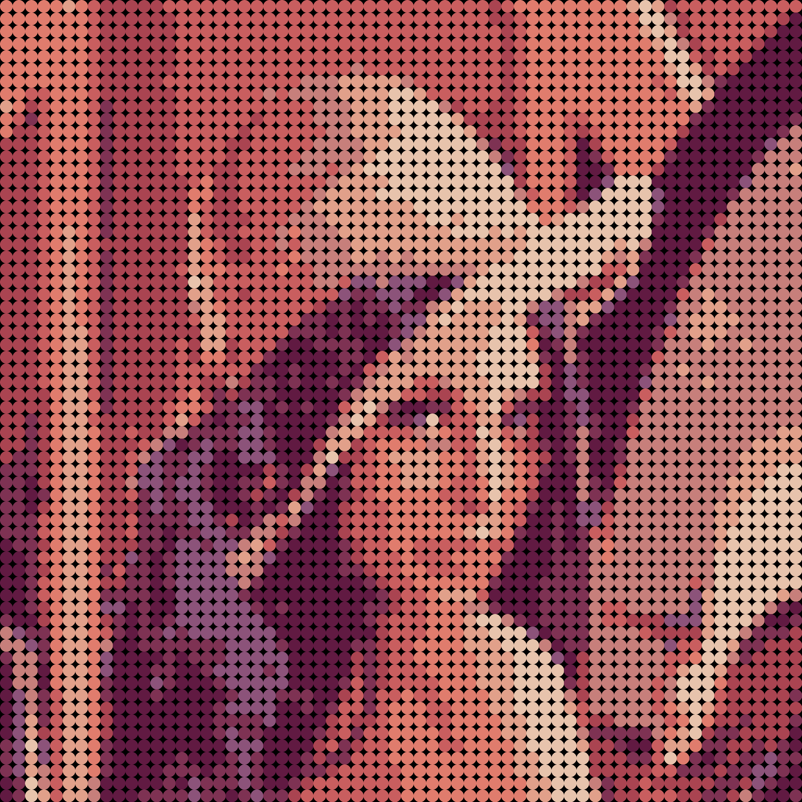
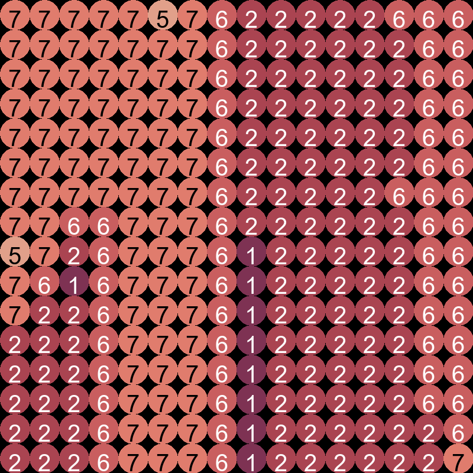
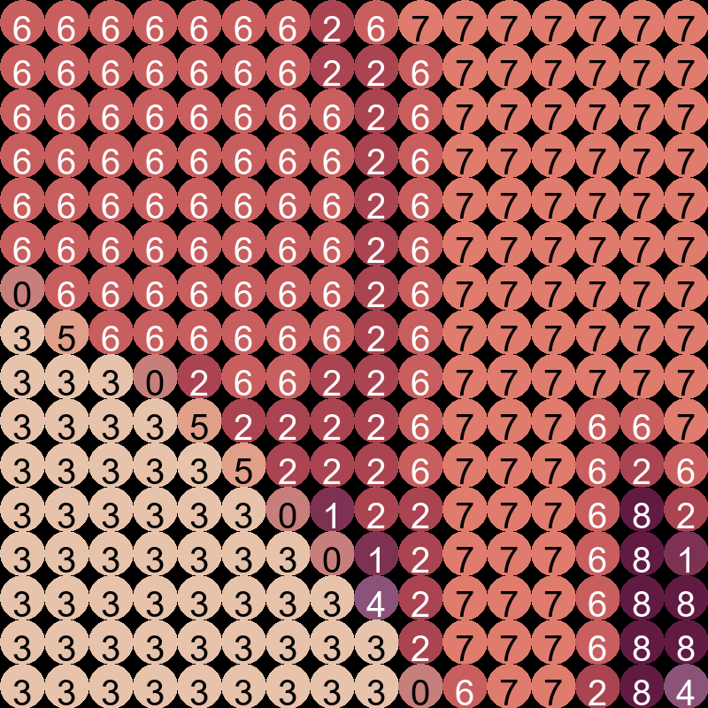
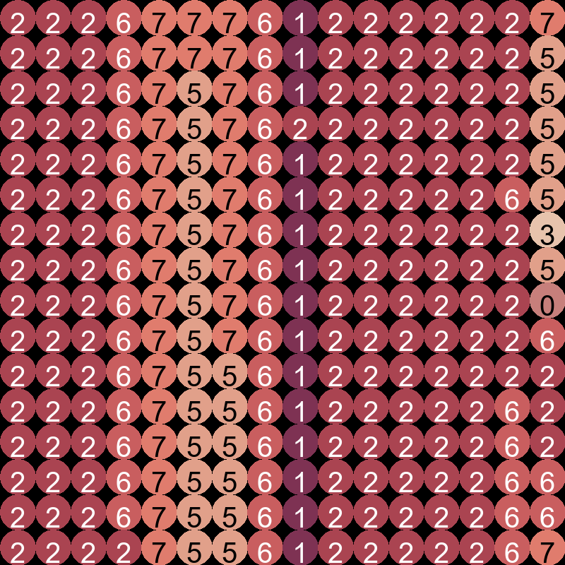
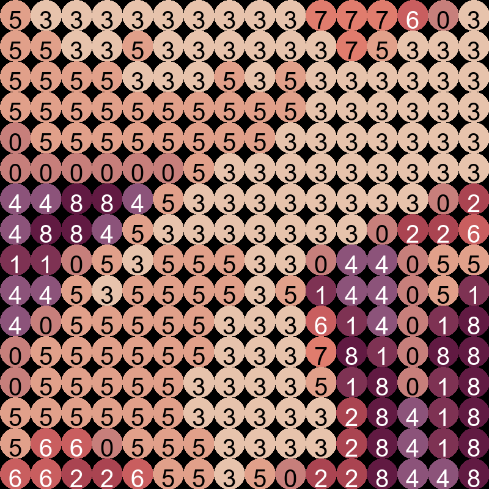

# Lego Art Creator

This project main idea is to take any image and create a lego-art instraction of how to build it. it allow the user to specify the size of the wanted lego-art, and the number the code can use to create the iamge.

| Full Image                                      | Lenna                                          |
| ----------------------------------------------- | ----------------------------------------------- |
|  |         |

## How to Use

Run the program using the following command:

```bash
python main.py
```

### Setting Input Parameters

Modify the `main.py` file to set the input parameters:

```python
if __name__ == "__main__":
    image_path = "Data/Lenna.png"  # Set the path to the input image
    size = [4, 4]  # Set the size of each block (e.g., 4x4)
    k_mean = 9  # Set the number of dominant colors
    main(image_path, size, k_mean)
```

- `image_path`: Path to the input image.
- `size`: Size of each block in the output Lego art, specified as a list `[width, height]`.
- `k_mean`: Number of dominant colors to be detected using k-means clustering.

### Program Workflow

The program follows these steps:

1. **Pixelation**: The input image is pixelated to the specified size (a multiple of 16x16).
2. **K-means Clustering**: The program uses k-means clustering to find the k most dominant colors in the pixelated image.
3. **Color Selection**: The user is presented with a Pygame window where they can adjust the selected colors generated by k-means clustering. Once satisfied, the user closes the window.
4. **Lego Color Assignment**: Another Pygame window opens where the user can manually select Lego colors for each dominant color detected in the image.
5. **PDF Creation**: Finally, the program generates a PDF instruction for the Lego art and saves it in the `output/` directory.

| 0                                      | 1                                          | 2                                     | 3                                          |
| ----------------------------------------------- | ----------------------------------------------- | ----------------------------------------------- | ----------------------------------------------- |
|  |         |  |         |
|  |         |  |         |


## Explanation of Functions

Here's an explanation of the functions used in the program:

### From `math_function.clustering`

- `get_kmean_color`: This function performs k-means clustering on the pixelated image to find the k most dominant colors.
- `cluster_points`: This function assigns each pixel to its nearest cluster center.

### From `generate_pdf_func`

- `create_pdf_from_directory`: This function creates a PDF instruction from the images saved in a directory.
- `generate_pixel_images`: This function generates pixelated images from the input image.
- `run_app`: This function handles the Pygame application for color selection and Lego color assignment.

Enjoy creating Lego art from your favorite images! 🎨🧱
